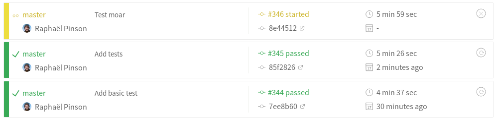

!SLIDE
## Testing Containers

* **Disclaimer:** not all the Puppet containers are actually tested
* **Principle:** use rspec + serverspec to test Dockerfiles
* **Example** with `docker-puppetboard`:


```ruby
require "serverspec"
require "docker"

describe "Dockerfile" do
  before(:all) do
    # See https://github.com/swipely/docker-api/issues/106
    Excon.defaults[:write_timeout] = 1000
    Excon.defaults[:read_timeout] = 1000
    image = Docker::Image.build_from_dir('.')

    set :os, family: :debian
    set :backend, :docker
    set :docker_image, image.id
    set :docker_container_create_options, { "Privileged" => true }
  end

  describe file('/app/puppetboard/app.py') do
    it { is_expected.to be_file }
  end
end
```


!SLIDE
## Testing the Puppetserver Container


Testing files and commands:

```ruby
describe file('/etc/puppetlabs/puppet/puppet.conf') do
  it { is_expected.to be_file }
end

describe command('/opt/puppetlabs/bin/puppet -V') do
  its(:exit_status) { is_expected.to eq 0 }
  its(:stdout) { is_expected.to match(/^4\.\d+.\d+\n$/) }
end

describe command('/opt/puppetlabs/bin/puppetserver gem list') do
  its(:exit_status) { is_expected.to eq 0 }
  its(:stdout) { is_expected.to match(/\bruby_gpg\b/) }
  its(:stdout) { is_expected.to match(/\bhiera-eyaml-gpg\b/) }
end

describe command('/opt/puppetlabs/bin/puppet master --configprint strict_variables') do
  its(:exit_status) { is_expected.to eq 0 }
  its(:stdout) { is_expected.to eq("true\n") }
end

describe file('/check_csr.rb') do
  it { is_expected.to be_file }
end

describe command('/opt/puppetlabs/bin/puppet master --configprint autosign') do
  its(:exit_status) { is_expected.to eq 0 }
  its(:stdout) { is_expected.to eq("/check_csr.rb\n") }
end
```


!SLIDE
## Testing the Puppetserver Container: output

```shell
$ bundle exec rspec -fd

Dockerfile
  File "/etc/puppetlabs/puppet/puppet.conf"
    should be file
  Command "/opt/puppetlabs/bin/puppet -V"
    exit_status
      should eq 0
    stdout
      should match /^4\.\d+.\d+\n$/
  Command "/opt/puppetlabs/bin/puppetserver gem list"
    exit_status
      should eq 0
    stdout
      should match /\bruby_gpg\b/
    stdout
      should match /\bhiera-eyaml-gpg\b/
  Command "/opt/puppetlabs/bin/puppet master --configprint strict_variables"
    exit_status
      should eq 0
    stdout
      should eq "true\n"
  File "/check_csr.rb"
    should be file
  Command "/opt/puppetlabs/bin/puppet master --configprint autosign"
    exit_status
      should eq 0
    stdout
      should eq "/check_csr.rb\n"

Finished in 20.99 seconds (files took 0.39334 seconds to load)
11 examples, 0 failures
```


!SLIDE
## CI/CD

* build
* test
* ship

```yaml
---
language: ruby
sudo: required
services: docker
cache: bundler
script:
  - ./.build.sh
  - bundle exec rspec -fd
after_success:
  - ./.publish.sh
```



