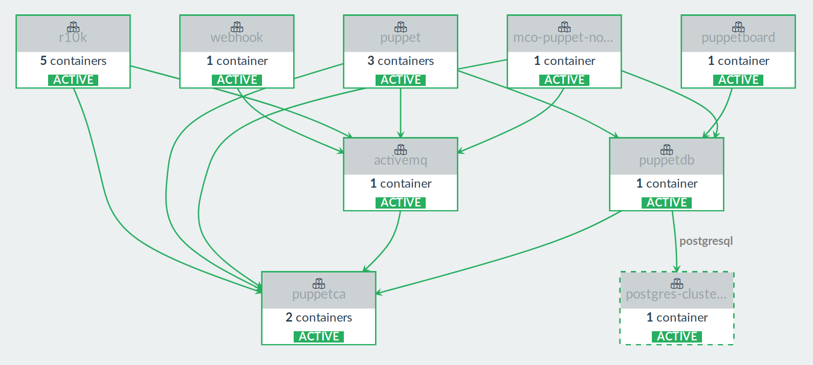

!SLIDE
## Deployment on Rancher

* Scaling on multiple nodes
* Catalog Template on [GitHub](https://github.com/camptocamp/camptocamp-rancher-catalog)





!SLIDE
## Automating Rancher with Terraform


```ruby
resource "rancher_stack" "puppet" {
  name            = "puppet"
  environment_id  = "a123"
  catalog_id      = "camptocamp:puppet:165"
  start_on_create = true
  finish_upgrade  = true
  depends_on      = ["rancher_stack.postgres-cluster"]

  environment {
    "ACTIVEMQ_DNS_ALT_NAMES"       = "activemq.example.com"
    "AUTH_CONF_ALLOW_CATALOG"      = "catalog_diff"
    "AUTOSIGN_PSK"                 = "HelloGhentPSK"
    "CA_CRT"                       = "${file("puppet/ca.crt")}"
    "CA_DNS_ALT_NAMES"             = "puppetca,puppetca.example.com"
    "CA_KEY"                       = "${file("puppet/ca.key")}"
    "DB_DNS_ALT_NAMES"             = "puppetdb,puppetdb.example.com"
    "DNS_ALT_NAMES"                = "puppet,puppet.example.com"
    "GITHUB_ORG"                   = "camptocamp"
    "GITHUB_TEAM"                  = "infrateam"
    "GITHUB_TOKEN"                 = "<gh_token>"
    "GPG_KEY"                      = "${file("puppet/gpg_key.asc")}"
    "MCOLLECTIVE_SERVER_KEY"       = "${file("puppet/mcollective_server.key")}"
    "PUPPETBOARD_TAG"              = "0.2.0-1"
    "PUPPETCA_JAVA_ARGS"           = "-XX:OnOutOfMemoryError=\"kill -9 %p\" -Djava.security.egd=/dev/urandom -Xmx2g -Xms2g -XX:MaxPermSize=256m"
    "PUPPETDB_JAVA_ARGS"           = "-XX:OnOutOfMemoryError=\"kill -9 %p\" -Djava.security.egd=/dev/urandom -Xmx1g"
    "PUPPETDB_POSTGRES_PASSWORD"   = "PostgresGhentPass"
    "PUPPETDB_POSTGRES_RO_SUBNAME" = "//postgresql:5433/puppetdb"
    "PUPPETDB_POSTGRES_SERVICE"    = "postgres-cluster/lb"
    "PUPPETDB_POSTGRES_USER"       = "puppetdb"
    "PUPPET_JAVA_ARGS"             = "-XX:OnOutOfMemoryError=\"kill -9 %p\" -Djava.security.egd=/dev/urandom -Xmx4g -Xms4g -XX:MaxPermSize=256m"
    "R10K_REMOTE"                  = "ssh://git@git.example.com/infra/control-repo.git"
    "RSA_PRIVATE_KEY"              = "${file("puppet/r10k_rsa.key")}"
    "STOMP_PASSWORD"               = "StompGhentPass"
    "WEBHOOK_SECRET"               = "WebhookGhentSec"
  }
}
```
