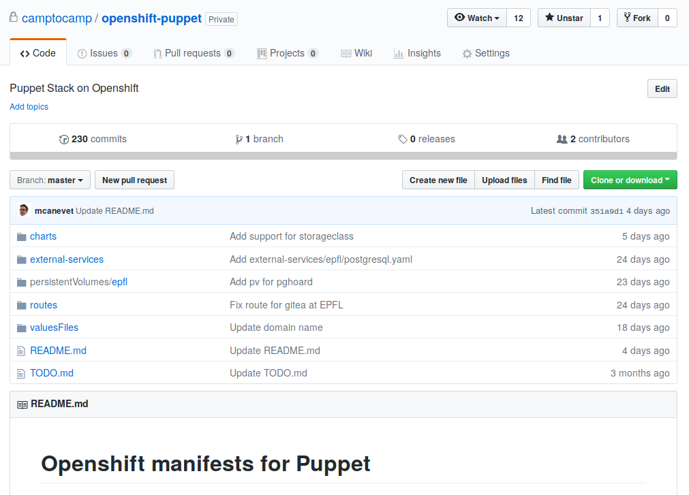
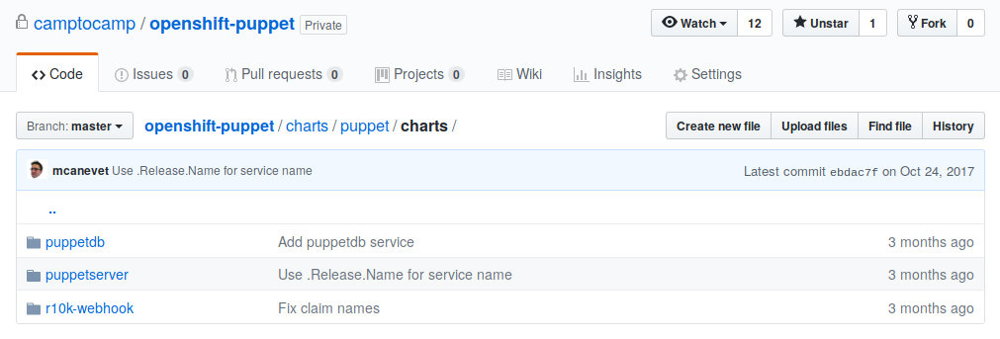

!SLIDE
## Puppet on Openshift

* in development, currently internal @ Camptocamp
* plans for our migration from Puppet 4 to Puppet 5

!SLIDE
## Puppet on Openshift: charts

* 3 Puppet charts currently: Puppetserver, PuppetDB & R10k-webhook

!SLIDE
## Puppet on Openshift: advantages

Charts take advantage of ImageStreams, ConfigMaps & Secrets (among others)

